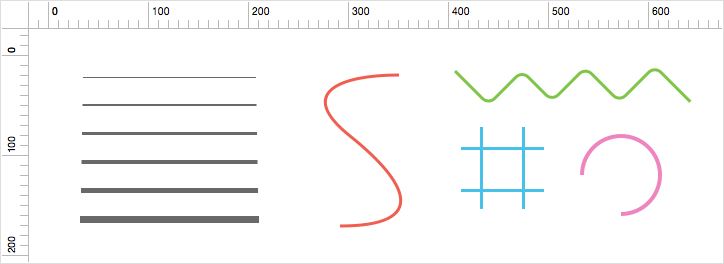
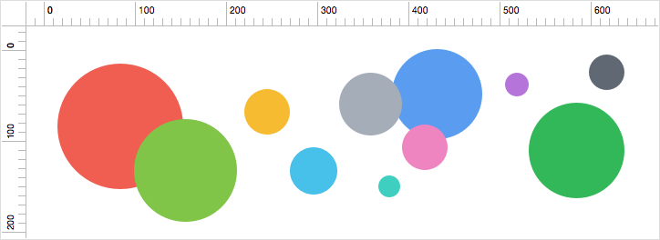

Sketch Plugins Cookbook
=======================

A collection of recipes for Sketch App plugins developers.

I will be posting daily updates in my twitter. Follow me [@turbobabr](https://twitter.com/turbobabr) to stay tuned.

## Create Line Shape

In order to create a line shape programmatically, you have to create an instance of [NSBezierPath](https://developer.apple.com/library/mac/Documentation/Cocoa/Reference/ApplicationKit/Classes/NSBezierPath_Class/index.html) class and add two points to it. Then create a shape group from it using `+(MSShapeGroup*)MSShapeGroup.shapeWithBezierPath:(NSBezierPath*)path` class method.



To make Sketch recognize the provided path as a line shape, you have to add only two points using `moveToPoint` & `lineToPoint` methods of `NSBezierPath`.

The following example creates a simple line shape with two points:
```JavaScript
var path = NSBezierPath.bezierPath();
path.moveToPoint(NSMakePoint(10,10));
path.lineToPoint(NSMakePoint(200,200));

var shape = MSShapeGroup.shapeWithBezierPath(path);
var border = shape.style().borders().addNewStylePart();
border.color = MSColor.colorWithSVGString("#dd0000");
border.thickness = 2;

doc.currentPage().addLayers([shape]);
```

The same way, you can easily create a multi segment line using methods provided by [NSBezierPath](https://developer.apple.com/library/mac/Documentation/Cocoa/Reference/ApplicationKit/Classes/NSBezierPath_Class/index.html) class. Whenever you add more than two points into the path, Sketch treats such shape as a vector path similar to what can be created using standard `V - Vector` tool.

The following example demonstrates how to create a curved path with four points:
```JavaScript
var path = NSBezierPath.bezierPath();
path.moveToPoint(NSMakePoint(84.5,161));
[path curveToPoint:NSMakePoint(166,79.5) controlPoint1:NSMakePoint(129.5,161) controlPoint2:NSMakePoint(166,124.5)];
[path curveToPoint:NSMakePoint(84.5,-2) controlPoint1:NSMakePoint(166,34.5) controlPoint2:NSMakePoint(129.5,-2)];
[path curveToPoint:NSMakePoint(3,79.5) controlPoint1:NSMakePoint(39.5,-2) controlPoint2:NSMakePoint(3,34.5)];

var shape = MSShapeGroup.shapeWithBezierPath(path);
var border = shape.style().borders().addNewStylePart();
border.color = MSColor.colorWithSVGString("#dd0000");
border.thickness = 2;

doc.currentPage().addLayers([shape]);
```

Complete examples:
- [Create Line Shape.sketchplugin](./Samples/Create Line Shape.sketchplugin)
- [Create Curved Line Shape.sketchplugin](./Samples/Create Curved Line Shape.sketchplugin)

Works in:
- Sketch 3.2 +

## Set Border Radius for Specific Corners

Starting from version 3.2 Sketch allows to set custom border radius for specific corner of rectangle shape. It was possible prior to 3.2, but there was no direct API.


In order to set custom radiuses you use `-MSRectangleShape.setCornerRadiusFromComponents:(NSString*)compoents` instance method, where `components` is a string that represents radius values for every corner separated by `/` sybmols. The sequence is following: `left-top/right-top/right-bottom/left-bottom`.

The following sample sets left-top and right-top corners of a selected rect shape to 15 points:
```JavaScript
var layer = selection.firstObject();
if(layer && layer.isKindOfClass(MSShapeGroup)) {
    var shape=layer.layers().firstObject();
    if(shape && shape.isKindOfClass(MSRectangleShape)) {
        shape.setCornerRadiusFromComponents("15/15/0/0");
    }
}
```

Complete examples:
- [Set Border Radius From Components.sketchplugin](./Samples/Set Border Radius From Components.sketchplugin)

Works in:
- Sketch 3.2 +

## Scaling Layers

You can scale any layer using `-MSLayer.multiplyBy:(double)scaleFactor` instance method, where `scaleFactor` is a floating-point value that is used to multiple all the layers' properties including position, size, and all the style attributes such as border thickness, shadow, etc. Here are some example scale factors: `1.0 = 100%`, `2.5 = 250%`, `0.5 = 50%`, etc.

This method produces the same result as a standard [Scale](http://bohemiancoding.com/sketch/support/documentation/03-layer-basics/4-resizing-layers.html) tool. Since all the layer type classes are inherited from `MSLayer` class, you can use this method to scale any type of layer including Pages and Artboards.

> Note: After the call of the method, `x` and `y` position values will also be multiplied. If you need the layer to remain in the same position after scaling, you'll have to change its position to the appropriate values.


The following sample demonstrates how to scale first selected layer:
```JavaScript
var layer = selection.firstObject();
if(layer) {
    // Preserve layer center point.
    var midX=layer.frame().midX();
    var midY=layer.frame().midY();

    // Scale layer by 200%
    layer.multiplyBy(2.0);

    // Translate frame to the original center point.
    layer.frame().midX = midX;
    layer.frame().midY = midY;
}
```

Works in:
- Sketch 3.1 +

## Finding Bounds For a Set of Layers

If you want to quickly find a bounding rectangle for selected layers or any set of layers, there is a very handy class method for that `+(GKRect*)MSLayerGroup.groupBoundsForLayers:(NSArray*)layers`. It accepts a list of layers and returns an instance of [GKRect](https://github.com/BohemianCoding/GeometryKit/blob/c738cdec6196230eada5925ebc19fe42bc1205f5/Source/GKRect.h) class which is the part of open source [GeometryKit](https://github.com/BohemianCoding/GeometryKit) by Bohemian Coding that is widely used in Sketch App.


A quick sample that demonstrate how to use it:
```JavaScript
var bounds=MSLayerGroup.groupBoundsForLayers(selection);

print("x: "+bounds.x());
print("y: "+bounds.y());
print("width: "+bounds.width());
print("height: "+bounds.height());
print("mixX: "+bounds.midX());
print("mixX: "+bounds.midY());
```

Works in:
- Sketch 3.1 +

## Create Oval Shape

In order to create an oval shape programmatically, you have to create an instance of `MSOvalShape` class, set its frame and wrap with `MSShapeGroup` container.



The following sample demonstrates how to do it:
```JavaScript
var ovalShape = MSOvalShape.alloc().init();
ovalShape.frame = MSRect.rectWithRect(NSMakeRect(0,0,100,100));

var shapeGroup=ovalShape.embedInShapeGroup();
var fill = shapeGroup.style().fills().addNewStylePart();
fill.color = MSColor.colorWithSVGString("#dd2020");

doc.currentPage().addLayers([shapeGroup]);
```

Complete examples:
- [Create Oval Shape.sketchplugin](./Samples/Create Oval Shape.sketchplugin)

Works in:
- Sketch 3.1 +

## Create Shared Style Programmatically

In order to create a shared style programmatically you use `-MSSharedLayerStyleContainer.addSharedStyleWithName:(NSString*)name firstInstance:(MSStyle*)style` method, where `name` is a name of shared style being created, `style` is a reference style used as a template for future shared style.

You can create a shared style from the existing style that is bound to some layer or create it from scratch with a custom `MSStyle` instance.


Create shared style from selected layers' style:
```JavaScript
var layer=selection.firstObject();
if(layer) {
    var sharedStyles=doc.documentData().layerStyles();
    sharedStyles.addSharedStyleWithName_firstInstance("Custom Style",layer.style());
}
```

Create shared style from scratch:
```JavaScript
var sharedStyles=doc.documentData().layerStyles();

var style=MSStyle.alloc().init();
var fill=style.fills().addNewStylePart();
fill.color = MSColor.colorWithSVGString("#B1C151");

sharedStyles.addSharedStyleWithName_firstInstance("Custom Style 2",style);

doc.reloadInspector();
```

Complete examples:
- [Create Shared Style From Selected Layer.sketchplugin](./Samples/Create Shared Style From Selected Layer.sketchplugin)
- [Create Shared Style Programmatically.sketchplugin](./Samples/Create Shared Style Programmatically.sketchplugin)

Works in:
- Sketch 3.1 +

## Missing 'MSColor.colorWithHex:alpha:'? :)

Prior to Sketch 3.2 there was a really nice and handy class method called `MSColor.colorWithHex:alpha:` that allowed to create instance of `MSColor` class with hex string, but unfortunately with the release of Sketch 3.2 version it was removed from the API.

Good news everyone! The replacement for this method does exist:
```JavaScript
// Create color without alpha.
var color = MSColor.colorWithSVGString("#FF0000");
print(color);
// -> (r:1.000000 g:0.000000 b:0.000000 a:1.000000)

// Create color with alpha.
var color = MSColor.colorWithSVGString("#FF0000");
color.alpha = 0.2;
print(color);
// -> (r:1.000000 g:0.000000 b:0.000000 a:0.200000)
```

Works in:
- Sketch 3.0 +

## Flatten Vector Layer

If you want to flatten a complex vector layer that contains several sub paths combined using different boolean operations into single layer, you can use `+MSShapeGroup.flatten` method.


This sample code flattens a first selected vector layer:
```JavaScript
var layer=selection.firstObject();
if(layer && layer.isKindOfClass(MSShapeGroup)) {
    layer.flatten();
}
```

Complete examples:
- [Flatten Vector Layer.sketchplugin](./Samples/Flatten Vector Layer.sketchplugin)

Works in:
- Sketch 3.2 +

## Flatten Layers to Bitmap

In order to flatten one or several layers of any type to a single `MSBitmapLayer`, use `-MSLayerFlattener.flattenLayers:` method. It accepts one arguments which is an array of layers to be flattened.


The following example flattens all the selected layers to a bitmap layer:
```JavaScript
var flattener = MSLayerFlattener.alloc().init();
flattener.flattenLayers(selection);
```
Complete examples:
- [Flatten Selection to Bitmap.sketchplugin](./Samples/Flatten Selection To Bitmap.sketchplugin)

Works in:
- Sketch 3.2 +

## Convert Text Layer to Outlines

In order to convert an existing `MSTextLayer` to `MSShapeGroup` layer, you have to get texts' `NSBezierPath` representation and then convert it to a `MSShapeGroup` layer.


The following source code demonstrates how to get text layers' vector outline and use it to create a vector shape from it:
```JavaScript
function convertToOutlines(layer) {
    if(!layer.isKindOfClass(MSTextLayer)) return;

    var parent=layer.parentGroup();
    var shape=MSShapeGroup.shapeWithBezierPath(layer.bezierPathWithTransforms());

    shape.style = layer.style();
    var style=shape.style();
    if(!style.fill()) {
        var fill=style.fills().addNewStylePart();
        fill.color = MSColor.colorWithNSColor(layer.style().textStyle().attributes().NSColor);
    }

    var isSelected=layer.isSelected();
    shape.name = layer.name();
    shape.setIsSelected(isSelected);

    parent.removeLayer(layer);
    parent.addLayers([shape]);

    return shape;
}

var layer=selection.firstObject();
if(layer) {
    var vectorizedTextLayer=convertToOutlines(layer);
    print(vectorizedTextLayer);
}
```
Complete examples:
- [Convert Text Layer to Outlines.sketchplugin](./Samples/Convert Text Layer to Outlines.sketchplugin)

Works in:
- Sketch 3.1 +

## Get Points Coords Along the Shape Path

If you want to distribute some shapes along a path there is a convenient method `-pointOnPathAtLength:` implemented in `NSBezierPath_Slopes` class extension.

This method accepts a `double` value from 0 to 1 and represents a length at which you want to get a point coordinate. It returns a `CGPoint` struct with coordinates of the point.


The following example divides shape path into 15 segments and prints out their points coordinates:
```JavaScript
var layer=selection.firstObject();
if(layer && layer.isKindOfClass(MSShapeGroup)) {

    var count=15;
    var path=layer.bezierPathWithTransforms();

    var step=path.length()/count;
    for(var i=0;i<=count;i++) {
        var point=path.pointOnPathAtLength(step*i);
        print(point);
    }
}
```
Complete examples:
- [Get Points Coords Along Path.sketchplugin](./Samples/Get Points Coords Along Path.sketchplugin)
- [Create Dots Along Path.sketchplugin](./Samples/Create Dots Along Path.sketchplugin)

Works in:
- Sketch 3.2 +
